<div align="center">

## Proyecto MongoDB

<br><br><br>
**Sistema Hospitalario**

<br><br><br>

**Sayara Aparicio**

**Mateo Román**

<br><br><br><br><br><br>

**S1**

**Pedro Felipe Gómez Bonilla**

<br><br><br><br><br><br>

**CAMPUSLANDS**

**RUTA NODE JS**

**BUCARAMANGA, SANTANDER**

**2025**

</div>

---

## Proyecto - Sistema de Gestión Hospitalaria con MongoDB

Este proyecto consiste en el diseño, implementación y consulta de una base de datos NoSQL utilizando MongoDB para gestionar la información de un sistema hospitalario en Colombia. El sistema maneja entidades como hospitales, personal médico, pacientes, tratamientos, medicamentos y visitas médicas. Es un sistema que no es muy complejo, pero es necesario pensar de forma lógica para poder llevarlo a cabo.

---


## Tabla de Contenidos

1.  [Introducción](#introducción)
2.  [Tecnologías Utilizadas](#tecnologías-utilizadas)
3.  [Requisitos Previos](#requisitos-previos)
4.  [Instalación y Puesta en Marcha](#instalación-y-puesta-en-marcha)
5.  [Caso de Estudio](#caso-de-estudio)
6.  [Estructura de la Base de Datos](#estructura-de-la-base-de-datos)
7.  [Consultas a la Base de Datos](#consultas-a-la-base-de-datos)
8.  [Autor](#autor)

---

## Introducción


El Sistema Hospitalario MongoDB es una solución integral de base de datos NoSQL diseñada para gestionar de manera eficiente todas las operaciones relacionadas con la administración hospitalaria. Este sistema contempla la gestión de hospitales, pacientes, médicos, tratamientos, medicamentos, visitas médicas, historiales clínicos, áreas especializadas y personal administrativo.


Una característica distintiva del sistema es su capacidad para mantener historiales médicos detallados que incluyen diagnósticos, tratamientos realizados y resultados obtenidos, proporcionando una vista integral del estado de salud de cada paciente a lo largo del tiempo. Esto es especialmente valioso para el seguimiento continuo de condiciones crónicas y la coordinación entre diferentes especialidades médicas.


El sistema también incorpora un robusto control de inventario de medicamentos, gestión de visitas médicas programadas y no programadas, así como un sistema de roles y permisos que garantiza que cada tipo de usuario tenga acceso únicamente a la información necesaria para desempeñar sus funciones.

---

## Tecnologías Utilizadas
* **MongoDB**: Base de datos NoSQL orientada a documentos.
* **MongoDB Shell (mongosh)**: Consola de comando propia de mongo, necesaria para ejecutar los scripts.
* **JavaScript**: Archivo para la inserción de datos.

---

## Requisitos Previos
Antes de empezar, asegúrate de tener instalado en tu sistema:
* MongoDB Compass
* MongoDB Shell (`mongosh`)

---

## Instalación y Puesta en Marcha

Sigue estos pasos para poner en funcionamiento el proyecto en tu entorno local:

1.  **Clonar el repositorio**:
    ```sh
    git clone https://github.com/Mvteiio/Proyecto_SistemaSalud_RomanMateo
    cd Proyecto_SistemaSalud_RomanMateo
    ```

2.  **Asegúrate de que el servicio de MongoDB esté corriendo** en tu máquina.

3.  **Cargar los datos de prueba**:
    Busca dónde está ubicado el archivo **JS**. Luego, abre `mongosh` desde MongoDB Compass, selecciona tu base de datos y carga el script:
    ```sh
    # En la terminal de mongosh
    use miHospitalDB
    load('ruta/a/tu/archivo/insercion_datos.js')
    ```
    Esto creará y poblará todas las colecciones necesarias.

---
## Caso de Estudio
El Sistema Hospitalario gestiona una red de hospitales que ofrecen servicios médicos especializados a pacientes individuales y colectivos. 

El sistema atiende diferentes tipos de usuarios: pacientes, médicos especialistas, enfermeras, personal administrativo y personal de mantenimiento.

Los hospitales cuentan con áreas especializadas que ofrecen descuentos por tratamientos en volumen basados en convenios institucionales. Además, el sistema debe soportar múltiples direcciones por paciente, gestión de historiales médicos, representantes médicos especializados y un esquema de seguimiento de tratamientos.

---

### Objetivos principales:

    • Gestión integral de pacientes y sus historiales médicos
    • Administración de personal médico y administrativo
    • Control de inventario de medicamentos y suministros
    • Seguimiento de visitas médicas y diagnósticos
    • Gestión de áreas especializadas por hospital
    • Sistema de roles y permisos diferenciados


### Planificación
 La planificación se centró en recopilar los requisitos funcionales a través de análisis de procesos hospitalarios. Se identificaron entidades clave, reglas del negocio (como descuentos por convenios institucionales), y flujos de información médica. También se destacó la necesidad de permitir múltiples seguros médicos por paciente, seguimiento de tratamientos, y precios variables de medicamentos en el tiempo.


## Modelo Conceptual

    • Hospital: Establecimientos médicos con áreas especializadas
    • Paciente: Personas que reciben atención médica
    • Médico: Profesionales especializados en diferentes áreas
    • Personal: Empleados con diferentes roles y responsabilidades
    • Área Especializada: Departamentos médicos especializados
    • Visita Médica: Consultas y atenciones médicas
    • Tratamiento: Procedimientos y terapias médicas
    • Medicamento: Fármacos y suministros médicos
    • Historial Médico: Registro histórico de atenciones

---

### Relaciones Claves

    • Un hospital puede tener múltiples áreas especializadas
    • Un director general puede supervisar varios hospitales
    • Un paciente puede tener múltiples visitas médicas
    • Un médico puede atender a múltiples pacientes
    • Un tratamiento puede requerir múltiples medicamentos
    • Un paciente puede tener múltiples seguros médicos
    • Una visita médica genera entradas en el historial médico

---

## Gráfica

```mermaid
---
config:
  theme: redux
---
flowchart TD
%% Entidades

    HOSPITAL["Hospital"]
    style HOSPITAL fill:#BBDEFB
    PACIENTES["Pacientes"]
    style PACIENTES fill:#BBDEFB
    PERSONAL["Personal"]
    style PERSONAL fill:#BBDEFB
    MEDICAMENTOS["Medicamentos"]
    style MEDICAMENTOS fill:#BBDEFB
    TRATAMIENTOS["Tratamientos"]
    style TRATAMIENTOS fill:#BBDEFB
    VISITASMEDICAS["Visitas_Medicas"]
    style VISITASMEDICAS     fill:#BBDEFB

    %% Atributos
    HId((Id_Hospital))
    HNombre((Nombre))
    HCiudad((Ciudad))
    HEspecialidades((Areas_Especializadas))
    HEspecializacion1((0))
    HEspecializacion2((1))
    HEspecializacion3((2))
    HIdDirector((Id_Director))

    PId((Id_Pacientes))
    PNum((Numero_Historia_Clinica))
    PNom((Nombre))
    PCiudad((Ciudad))
    PDir((Direccion))
    PTel((Telefono))
    PSeguro((Seguro))
    PHistorial((Historial))
    PHiFecha((Fecha))
    PHiDiag((Diagnostico))
    PHiTra((Id_tratamiento))
    PiRes((Resultados))

    PeId((Id_Personal))
    PeNom((Nombre))
    PeNum((Numero_Colegiatura))
    PeEspecialidad((Especialidad))
    PeTel((Telefono))
    PeCorreo((Correo))
    PeSal((Salario))
    PeHos((Id_Hospital))
    PeRol((Rol))
    PeRC((Codigo))
    PeRD((Descripcion))

    MId((Id_Medicamentos))
    MNom((Nombre))
    MFab((Fabricante))
    MTipo((Tipo))
    MInventario((Inventario))
    MIn0((0))
    MIn0ID((Id_Hospital))
    MIn0Dis((Disponibilidad))
    MIn1((1))
    MIn1ID((Id_Hospital))
    MIn1Dis((Disponibilidad))

    TId((Id_Tratamientos))
    TNom((Nombre))
    TDes((Descripcion))
    TArea((Area_Medica))
    TCosto((Costo))

    VMId((Id_VM))
    VMFecha((Fecha))
    VMP((Id_Paciente))
    VMM((Id_Medico))
    VMH((Id_Hospital))
    VMDiag((Diagnostico))
    VMObs((Observaciones))

    %% Relaciones
    HOSPITAL --> HId
    HOSPITAL --> HNombre
    HOSPITAL --> HCiudad
    HOSPITAL --> HEspecialidades
    HEspecialidades --> HEspecializacion1    
    HEspecialidades --> HEspecializacion2
    HEspecialidades --> HEspecializacion3
    HOSPITAL --> HIdDirector

    PACIENTES --> PId
    PACIENTES --> PNum
    PACIENTES --> PNom
    PACIENTES --> PCiudad
    PACIENTES --> PDir
    PACIENTES --> PTel
    PACIENTES --> PSeguro
    PACIENTES --> PHistorial
    PHistorial --> PHiFecha
    PHistorial --> PHiDiag
    PHistorial --> PHiTra
    PHistorial --> PiRes

    PERSONAL --> PeId
    PERSONAL --> PeNom
    PERSONAL --> PeNum
    PERSONAL --> PeEspecialidad
    PERSONAL --> PeTel
    PERSONAL --> PeCorreo
    PERSONAL --> PeSal
    PERSONAL --> PeHos
    PERSONAL --> PeRol
    PeRol --> PeRC
    PeRol --> PeRD

    MEDICAMENTOS --> MId
    MEDICAMENTOS --> MNom
    MEDICAMENTOS --> MFab
    MEDICAMENTOS --> MTipo
    MEDICAMENTOS --> MInventario
    MInventario --> MIn0
    MIn0 --> MIn0ID
    MIn0 --> MIn0Dis
    MInventario --> MIn1
    MIn1 --> MIn1ID
    MIn1 --> MIn1Dis

    TRATAMIENTOS --> TId
    TRATAMIENTOS --> TNom
    TRATAMIENTOS --> TDes
    TRATAMIENTOS --> TArea
    TRATAMIENTOS --> TCosto

    VISITASMEDICAS --> VMId
    VISITASMEDICAS --> VMFecha
    VISITASMEDICAS --> VMP
    VISITASMEDICAS --> VMM
    VISITASMEDICAS --> VMH
    VISITASMEDICAS --> VMDiag
    VISITASMEDICAS --> VMObs

    HOSPITAL --> PERSONAL
    PACIENTES --> VISITASMEDICAS
    PERSONAL --> VISITASMEDICAS








```




## Estructura de la Base de Datos
El sistema utiliza un **modelo de datos híbrido**. Las entidades principales como `personal`, `pacientes` y `hospitales` están en colecciones separadas (normalizadas) para garantizar la integridad y escalabilidad. La información fuertemente acoplada, como el `historial` de un paciente, se mantiene incrustada (desnormalizada) para optimizar las lecturas.

A continuación se describe cada colección:

### `hospitales`
Almacena la información general de cada centro hospitalario.
```json
{
  "_id": "ObjectId(...)",
  "nombre": "Hospital Universitario del Valle",
  "ciudad": "Cali",
  "director_id": "ObjectId(...)",
  "especialidades": ["Oncología", "Cardiología", "Neurología"]
}
```

### `personal`
Contiene a todos los empleados del sistema, diferenciados por un rol.

```json
{
  "_id": "ObjectId(...)",
  "nombre": "Carlos Jaramillo",
  "numeroColegiatura": "76001",
  "especialidad": "Oncología",
  "salario": 7500000,
  "hospital_id": "ObjectId(...)",
  "rol": {
    "codigo": "002",
    "descripcion": "Médico Especialista"
  }
}
```

### `pacientes`
Guarda la información de los pacientes y su historial clínico (incrustado).


```json
{
  "_id": "ObjectId(...)",
  "numeroHistoriaClinica": 101,
  "nombre": "Juan Pérez",
  "seguro": "Sura EPS",
  "historial": [
    {
      "fecha": "ISODate(...)",
      "diagnostico": "Leucemia",
      "tratamiento_id": "ObjectId(...)",
      "resultados": "En progreso"
    }
  ]
}
```

### `tratamientos`
Catálogo central de los tratamientos disponibles.

```json
{
  "_id": "ObjectId(...)",
  "nombre": "Quimioterapia Estándar",
  "areaMedica": "Oncología",
  "costo": 1500000
}
```

### `medicamentos`
Inventario central de medicamentos, con stock detallado por hospital.

```json
{
  "_id": "ObjectId(...)",
  "nombre": "Acetaminofén 500mg",
  "fabricante": "Genfar",
  "inventario_por_hospital": [
    {
      "hospital_id": "ObjectId(...)",
      "disponibilidad": 2000
    }
  ]
}
```

### `visitasMedicas`
Registro de cada cita o visita, vinculando pacientes, médicos y hospitales.

```json
{
  "_id": "ObjectId(...)",
  "fecha": "ISODate(...)",
  "paciente_id": "ObjectId(...)",
  "medico_id": "ObjectId(...)",
  "hospital_id": "ObjectId(...)",
  "diagnostico": "Seguimiento Leucemia"
}
```

## Consultas a la base de datos
El objetivo es implementar **100 consultas** para analizar la información desde diferentes perspectivas. A continuación, se muestran las consultas implementadas.


### Consulta 1: Pacientes por EPS
Filtra a todos los pacientes que pertenecen a una EPS específica.
```javascript
db.pacientes.find({ seguro: "Sura EPS" })
```
---
### Consulta 2: Médicos por Especialidad
Busca a todo el personal médico que corresponde a una especialidad determinada.

```javascript
db.personal.find({
  "rol.descripcion": "Médico Especialista",
  "especialidad": "Cardiología"
});
```
---
### Consulta 3: Tratamientos de Alto Costo
Lista los tratamientos cuyo costo es superior a un valor determinado.

```javascript
db.tratamientos.find({ costo: { $gt: 5000000 } });
```
---
### Consulta 4: Conteo de Hospitales por Ciudad
Cuenta el número de hospitales registrados en una ciudad específica.

```javascript
db.hospitales.countDocuments({ ciudad: "Bogotá" });
```
---
### Consulta 5: Búsqueda de Medicamento por Nombre
Encuentra un medicamento utilizando su nombre comercial.

```javascript
db.medicamentos.findOne({ nombre: "Acetaminofén 500mg" });
```
---
### Consulta 6: Personal con Salario Elevado
Filtra al personal cuyo salario es mayor a una cifra específica.

```javascript
db.personal.find({ salario: { $gt: 8000000 } });
```
---
### Consulta 7: Búsqueda de Pacientes por Patrón de Nombre
Encuentra pacientes cuyo nombre comienza con una letra específica usando expresiones regulares.

```javascript
db.pacientes.find({ nombre: { $regex: /^A/ } });
```
---
### Consulta 8: Visitas Médicas por Fecha
Lista todas las visitas médicas que ocurrieron durante un día específico.

```javascript
db.visitasMedicas.find({
  fecha: {
    $gte: ISODate("2025-07-15T00:00:00Z"),
    $lt: ISODate("2025-07-16T00:00:00Z")
  }
});
```
---
### Consulta 9: Pacientes por Diagnóstico en Historial
Encuentra pacientes que tengan un diagnóstico particular en su historial clínico.

```javascript
db.pacientes.find({ "historial.diagnostico": "Fractura de tibia" });
```
---
### Consulta 10: Conteo Total de Médicos
Cuenta el número total de médicos registrados en el sistema.

```javascript
db.personal.countDocuments({ "rol.codigo": "002" });
```
---
### Consulta 11: Médicos Agrupados por Especialidad (Agregación)
Agrupa al personal médico y cuenta cuántos hay por cada especialidad.
```javascript
db.personal.aggregate([
  { $match: { "rol.descripcion": "Médico Especialista" } },
  { $group: { _id: "$especialidad", totalMedicos: { $sum: 1 } } },
  { $sort: { totalMedicos: -1 } }
]);
```
---
### Consulta 12: Salario Promedio por Especialidad (Agregación)
Calcula el salario promedio de los médicos, agrupado por su especialidad.
```javascript
db.personal.aggregate([
  { $match: { "rol.codigo": "002" } },
  { $group: {
      _id: "$especialidad",
      salarioPromedio: { $avg: "$salario" }
    }
  },
  { $project: {
      _id: 1,
      salarioPromedio: { $round: ["$salarioPromedio", 2] }
    }
  }
]);
```
---
### Consulta 13: Stock Total de Medicamentos (Agregación)
Suma el stock de cada medicamento a través de todos los hospitales.
```javascript
db.medicamentos.aggregate([
  { $unwind: "$inventario_por_hospital" },
  { $group: {
      _id: "$nombre",
      stockTotal: { $sum: "$inventario_por_hospital.disponibilidad" }
    }
  },
  { $sort: { stockTotal: 1 } }
]);
```
---
### Consulta 14: Número de Médicos por Hospital (Agregación)
Lista cada hospital junto con el número total de médicos que trabajan en él.
```javascript
db.personal.aggregate([
  { $match: { "rol.codigo": "002" } },
  { $group: { _id: "$hospital_id", numeroDeMedicos: { $sum: 1 } } },
  {
    $lookup: {
      from: "hospitales",
      localField: "_id",
      foreignField: "_id",
      as: "datosHospital"
    }
  },
  { $unwind: "$datosHospital" },
  {
    $project: {
      _id: 0,
      nombreHospital: "$datosHospital.nombre",
      ciudad: "$datosHospital.ciudad",
      numeroDeMedicos: 1
    }
  }
]);
```
---
### Consulta 15: Top 5 Pacientes con Más Visitas (Agregación)
Identifica a los cinco pacientes que han tenido la mayor cantidad de visitas médicas.
```javascript
db.visitasMedicas.aggregate([
  { $group: { _id: "$paciente_id", totalVisitas: { $sum: 1 } } },
  { $sort: { totalVisitas: -1 } },
  { $limit: 5 },
  {
    $lookup: {
      from: "pacientes",
      localField: "_id",
      foreignField: "_id",
      as: "infoPaciente"
    }
  },
  { $unwind: "$infoPaciente" },
  { $project: { _id: 0, nombrePaciente: "$infoPaciente.nombre", totalVisitas: 1 } }
]);
```
---
### Consulta 16: Popularidad de Tratamientos (Agregación)
Cuenta cuántos pacientes han recibido cada tipo de tratamiento disponible.
```javascript
db.pacientes.aggregate([
  { $unwind: "$historial" },
  { $group: { _id: "$historial.tratamiento_id", numeroPacientes: { $sum: 1 } } },
  {
    $lookup: {
      from: "tratamientos",
      localField: "_id",
      foreignField: "_id",
      as: "infoTratamiento"
    }
  },
  { $unwind: "$infoTratamiento" },
  {
    $project: {
      _id: 0,
      nombreTratamiento: "$infoTratamiento.nombre",
      areaMedica: "$infoTratamiento.areaMedica",
      numeroPacientes: 1
    }
  },
  { $sort: { numeroPacientes: -1 } }
]);
```
---
### Consulta 17: Pacientes Atendidos por un Médico Específico (Agregación)
Obtiene la lista de pacientes únicos que han sido atendidos por un médico en particular.
```javascript
// Primero, busca el ID del médico que quieres consultar
const medicoId = db.personal.findOne({ nombre: "Mariana Pajón" })._id;

// Luego, usa ese ID en la agregación
db.visitasMedicas.aggregate([
  { $match: { medico_id: medicoId } },
  {
    $lookup: {
      from: "pacientes",
      localField: "paciente_id",
      foreignField: "_id",
      as: "pacienteInfo"
    }
  },
  { $unwind: "$pacienteInfo" },
  {
    $group: {
      _id: "$pacienteInfo._id",
      nombre: { $first: "$pacienteInfo.nombre" },
      seguro: { $first: "$pacienteInfo.seguro" }
    }
  },
  { $project: { _id: 0, nombre: 1, seguro: 1 } }
]);
```
---
### Consulta 18: Disponibilidad de Medicamento por Hospital (Agregación)
Muestra el stock de un medicamento específico, desglosado por cada hospital.
```javascript
db.medicamentos.aggregate([
    { $match: { nombre: "Acetaminofén 500mg" } },
    { $unwind: "$inventario_por_hospital" },
    {
        $lookup: {
            from: "hospitales",
            localField: "inventario_por_hospital.hospital_id",
            foreignField: "_id",
            as: "hospitalInfo"
        }
    },
    { $unwind: "$hospitalInfo" },
    {
        $project: {
            _id: 0,
            medicamento: "$nombre",
            hospital: "$hospitalInfo.nombre",
            disponibilidad: "$inventario_por_hospital.disponibilidad"
        }
    }
]);
```
---
### Consulta 19: Diagnósticos Más Comunes (Agregación)
Calcula la frecuencia de cada diagnóstico registrado en las visitas para encontrar los más comunes.
```javascript
db.visitasMedicas.aggregate([
    { $group: { _id: "$diagnostico", frecuencia: { $sum: 1 } } },
    { $sort: { frecuencia: -1 } },
    { $limit: 10 }
]);
```
---
### Consulta 20: Médicos que Atienden a una EPS (Agregación)
Identifica qué médicos han tratado a pacientes afiliados a una EPS específica.
```javascript
db.pacientes.aggregate([
    { $match: { seguro: "Sura EPS" } },
    {
        $lookup: {
            from: "visitasMedicas",
            localField: "_id",
            foreignField: "paciente_id",
            as: "visitas"
        }
    },
    { $unwind: "$visitas" },
    {
        $lookup: {
            from: "personal",
            localField: "visitas.medico_id",
            foreignField: "_id",
            as: "medicoInfo"
        }
    },
    { $unwind: "$medicoInfo" },
    {
        $group: {
            _id: "$medicoInfo._id",
            nombreMedico: { $first: "$medicoInfo.nombre" },
            especialidad: { $first: "$medicoInfo.especialidad" }
        }
    },
    { $project: { _id: 0 } }
]);
```
---

### Consulta 21: Personal de Enfermería
Busca en la colección 'personal' a quienes tengan el rol de 'Enfermero/a'.
```javascript
db.personal.find({ "rol.descripcion": "Enfermero/a" });
```
---
### Consulta 22: Paciente por Número de Historia Clínica
Búsqueda precisa y rápida para obtener un único paciente.
```javascript
db.pacientes.findOne({ numeroHistoriaClinica: 101 });
```
---
### Consulta 23: Tratamientos del Área de Ortopedia
Filtra el catálogo de tratamientos por su área médica.
```javascript
db.tratamientos.find({ areaMedica: "Ortopedia" });
```
---
### Consulta 24: Medicamentos Fabricados por Genfar
Filtra el inventario de medicamentos por el nombre del fabricante.
```javascript
db.medicamentos.find({ fabricante: "Genfar" });
```
---
### Consulta 25: Hospitales con Especialidad en Pediatría
Busca un valor específico dentro de un campo de tipo array.
```javascript
db.hospitales.find({ especialidades: "Pediatría" });
```
---
### Consulta 26: Médicos con Salario en Rango Específico
Usa operadores para definir un rango salarial.
```javascript
db.personal.find({
  "rol.codigo": "002",
  "salario": { $gte: 7000000, $lte: 7800000 }
});
```
---
### Consulta 27: Pacientes con Dirección que Contiene 'Avenida'
Búsqueda por patrón de texto no sensible a mayúsculas/minúsculas.
```javascript
db.pacientes.find({ direccion: { $regex: /Avenida/i } });
```
---
### Consulta 28: Medicamentos con Bajo Stock en Hospital Específico
Busca disponibilidad baja en inventario de un hospital determinado.
```javascript
const hospitalValleId = db.hospitales.findOne({ nombre: "Hospital Universitario del Valle" })._id;

db.medicamentos.find({
  inventario_por_hospital: {
    $elemMatch: { hospital_id: hospitalValleId, disponibilidad: { $lt: 1000 } }
  }
});
```
---
### Consulta 29: Visitas Médicas en Julio de 2025
Usamos operadores de comparación sobre fechas.
```javascript
db.visitasMedicas.find({
  fecha: {
    $gte: ISODate("2025-07-01T00:00:00Z"),
    $lt: ISODate("2025-08-01T00:00:00Z")
  }
});
```
---
### Consulta 30: Pacientes sin Historial Clínico
Busca pacientes con historial vacío.
```javascript
db.pacientes.find({ historial: { $size: 0 } });
```

---

## Consultas de Agregación Avanzada

### Consulta 31: Número de Pacientes por EPS
Agrupa pacientes por seguro médico.
```javascript
db.pacientes.aggregate([
  { $group: { _id: "$seguro", totalPacientes: { $sum: 1 } } },
  { $sort: { totalPacientes: -1 } }
]);
```
---
### Consulta 32: Personal y su Hospital Ordenado por Salario
Une 'personal' con 'hospitales' y ordena por salario.
```javascript
db.personal.aggregate([
  { $sort: { salario: -1 } },
  {
    $lookup: {
      from: "hospitales",
      localField: "hospital_id",
      foreignField: "_id",
      as: "hospital"
    }
  },
  { $unwind: { path: "$hospital", preserveNullAndEmptyArrays: true } },
  {
    $project: {
      _id: 0,
      nombre: 1,
      rol: "$rol.descripcion",
      salario: 1,
      hospital: { $ifNull: [ "$hospital.nombre", "N/A" ] }
    }
  }
]);
```
---
### Consulta 33: Médicos Más Activos
Cuenta visitas por médico y recupera sus nombres.
```javascript
db.visitasMedicas.aggregate([
  { $group: { _id: "$medico_id", numeroVisitas: { $sum: 1 } } },
  { $sort: { numeroVisitas: -1 } },
  { $limit: 5 },
  {
    $lookup: {
      from: "personal",
      localField: "_id",
      foreignField: "_id",
      as: "medico"
    }
  },
  { $unwind: "$medico" },
  {
    $project: {
      _id: 0,
      nombreMedico: "$medico.nombre",
      especialidad: "$medico.especialidad",
      numeroVisitas: 1
    }
  }
]);
```
---
### Consulta 34: Número de Visitas por Mes
Agrupa visitas por mes y año.
```javascript
db.visitasMedicas.aggregate([
  {
    $group: {
      _id: {
        anio: { $year: "$fecha" },
        mes: { $month: "$fecha" }
      },
      totalVisitas: { $sum: 1 }
    }
  },
  { $sort: { "_id.anio": 1, "_id.mes": 1 } }
]);
```
---
### Consulta 35: Pacientes con Múltiples Diagnósticos
Filtra pacientes con más de un diagnóstico.
```javascript
db.pacientes.aggregate([
  {
    $project: {
      nombre: 1,
      seguro: 1,
      numeroDiagnosticos: { $size: "$historial" }
    }
  },
  { $match: { numeroDiagnosticos: { $gt: 1 } } }
]);
```
---
### Consulta 36: Diagnósticos Únicos
Agrupa todos los diagnósticos únicos.
```javascript
db.pacientes.aggregate([
  { $unwind: "$historial" },
  { $group: { _id: "$historial.diagnostico" } },
  { $project: { _id: 0, diagnostico: "$_id" } }
]);
```
---
### Consulta 37: Tratamiento Más Caro y Más Barato
Calcula el máximo y mínimo costo.
```javascript
db.tratamientos.aggregate([
  {
    $group: {
      _id: null,
      tratamientoMasCaro: { $max: "$costo" },
      tratamientoMasBarato: { $min: "$costo" }
    }
  }
]);
```
---
### Consulta 38: Pacientes sin Visitas Médicas
Filtra pacientes sin visitas usando `$lookup`.
```javascript
db.pacientes.aggregate([
  {
    $lookup: {
      from: "visitasMedicas",
      localField: "_id",
      foreignField: "paciente_id",
      as: "visitas"
    }
  },
  { $match: { visitas: { $size: 0 } } },
  { $project: { nombre: 1, telefono: 1, seguro: 1 } }
]);
```
---
### Consulta 39: Promedio de Especialidades por Hospital
Calcula el promedio del número de especialidades.
```javascript
db.hospitales.aggregate([
  {
    $project: {
      nombre: 1,
      numeroEspecialidades: { $size: "$especialidades" }
    }
  },
  {
    $group: {
      _id: "promedioGeneral",
      promedioEspecialidades: { $avg: "$numeroEspecialidades" }
    }
  }
]);
```
---
### Consulta 40: Médicos que Atendieron Casos de Leucemia
Une varias colecciones para identificar médicos por especialidad.
```javascript
db.pacientes.aggregate([
  { $match: { "historial.diagnostico": "Leucemia" } },
  {
    $lookup: {
      from: "visitasMedicas",
      localField: "_id",
      foreignField: "paciente_id",
      as: "visita"
    }
  },
  { $unwind: "$visita" },
  {
    $lookup: {
      from: "personal",
      localField: "visita.medico_id",
      foreignField: "_id",
      as: "medico"
    }
  },
  { $unwind: "$medico" },
  {
    $group: {
      _id: "$medico.especialidad",
      medicos: { $addToSet: "$medico.nombre" }
    }
  },
  {
    $project: {
      _id: 0,
      especialidad: "$_id",
      medicosQueAtendieron: "$medicos"
    }
  }
]);
```
---
### Consulta 41: Médicos que Atendieron Casos de Leucemia
Filtra la colección de personal buscando un rol específico que no habíamos buscado antes.
```javascript
db.personal.find({ "rol.descripcion": "Personal Administrativo" });
```
---
### Consulta 42: Listar todos los tratamientos que no pertenecen al área de "Cardiología"
Usa el operador $ne (not equal) para excluir una categoría.
```javascript
db.tratamientos.find({ areaMedica: { $ne: "Cardiología" } });
```

---

### Consulta 43: Encontrar pacientes con un prefijo telefónico específico.
Útil para buscar usuarios por región o compañía telefónica, usando una expresión regular.
```javascript
db.pacientes.find({ telefono: { $regex: /^301/ } });
```
---
### Consulta 44: Contar cuántos pacientes están afiliados a "Compensar".
Un conteo directo y eficiente sobre un campo específico.
```javascript
db.pacientes.countDocuments({ seguro: "Compensar" });
```
---
### Consulta 45: Encontrar al director del hospital por su nombre (ignorando mayúsculas/minúsculas).
Búsqueda flexible de texto con la opción 'i' para insensibilidad a mayúsculas.
```javascript
db.personal.findOne({
  nombre: { $regex: /lucía fernández/i },
  "rol.codigo": "001"
});
```
---
### Consulta 46: Listar todos los medicamentos cuyo tipo de administración sea "Inyección".
Filtra el catálogo de medicamentos por su forma de administración.
```javascript
db.medicamentos.find({ tipo: "Inyección" });
```
---

### Consulta 47: Listar los hospitales que ofrecen más de 3 especialidades.
Usa el operador $expr para comparar campos dentro del mismo documento, en este caso, el tamaño del array 'especialidades'.
```javascript
db.hospitales.find({
  $expr: { $gt: [ { $size: "$especialidades" }, 3 ] }
});
```
---
### Consulta 48: Encontrar todas las visitas médicas cuyo diagnóstico contenga la palabra "Control".
Similar a otras búsquedas de texto, pero aplicada a las observaciones de una visita.
```javascript
db.visitasMedicas.find({ diagnostico: { $regex: /Control/i } });
```
---
### Consulta 49: Encontrar al personal que no tiene un hospital asignado.
Útil para roles directivos o personal flotante. Busca documentos donde el campo **hospital_id** no existe.
```javascript
db.personal.find({ hospital_id: { $exists: false } });
```
---
### Consulta 50: Encontrar todos los tratamientos cuyo costo sea inferior a 100,000.
Filtra por un umbral de bajo costo usando $lt (less than).
```javascript
db.tratamientos.find({ costo: { $lt: 100000 } });
```
---
### Consulta 51: Calcular el gasto total en salarios por cada hospital.
Agrupa al personal por hospital y suma sus salarios para obtener el costo operativo de personal.
```javascript
db.personal.aggregate([
  { $match: { hospital_id: { $exists: true } } },
  {
    $group: {
      _id: "$hospital_id",
      gastoTotalSalarios: { $sum: "$salario" }
    }
  },
  {
    $lookup: {
      from: "hospitales",
      localField: "_id",
      foreignField: "_id",
      as: "hospitalInfo"
    }
  },
  { $unwind: "$hospitalInfo" },
  {
    $project: {
      _id: 0,
      hospital: "$hospitalInfo.nombre",
      gastoTotalSalarios: 1
    }
  }
]);
```
---

### Consulta 52: Encontrar el día de la semana con más visitas médicas.
Extrae el día de la semana de la fecha, lo agrupa y cuenta para encontrar el día más concurrido.
```javascript
db.visitasMedicas.aggregate([
  {
    $project: {
      diaDeLaSemana: { $dayOfWeek: "$fecha" }
    }
  },
  {
    $group: {
      _id: "$diaDeLaSemana",
      numeroDeVisitas: { $sum: 1 }
    }
  },
  { $sort: { numeroDeVisitas: -1 } },
  { $limit: 1 }
]);
```
---
### Consulta 53: Calcular la antigüedad del historial de cada paciente.
Para cada paciente, encuentra la fecha mínima y máxima en su historial y calcula la diferencia.
```javascript
db.pacientes.aggregate([
  { $unwind: "$historial" },
  {
    $group: {
      _id: "$_id",
      nombre: { $first: "$nombre" },
      primeraEntrada: { $min: "$historial.fecha" },
      ultimaEntrada: { $max: "$historial.fecha" }
    }
  },
  {
    $project: {
      nombre: 1,
      duracionHistorialDias: {
        $round: [
          { $divide: [ { $subtract: ["$ultimaEntrada", "$primeraEntrada"] }, 1000 * 60 * 60 * 24 ] },
          0
        ]
      }
    }
  }
]);
```
---
### Consulta 54: Listar cada hospital junto con la información completa de su director.
Realiza un $lookup desde hospitales hacia personal para traer los datos del director.
```javascript
db.hospitales.aggregate([
  {
    $lookup: {
      from: "personal",
      localField: "director_id",
      foreignField: "_id",
      as: "infoDirector"
    }
  },
  { $unwind: { path: "$infoDirector", preserveNullAndEmptyArrays: true } },
  {
    $project: {
      _id: 0,
      nombreHospital: "$nombre",
      ciudad: "$ciudad",
      director: {
        nombre: "$infoDirector.nombre",
        correo: "$infoDirector.correo"
      }
    }
  }
]);
```
---
### Consulta 55: Contar cuántos tipos de medicamentos provee cada fabricante.
Agrupa los medicamentos por fabricante y cuenta cuántos documentos (tipos de med) tiene cada uno.
```javascript
db.medicamentos.aggregate([
  { $group: { _id: "$fabricante", numeroDeMedicamentos: { $sum: 1 } } },
  { $sort: { numeroDeMedicamentos: -1 } }
]);
```
---
### Consulta 56: Calcular el costo promedio de los tratamientos por cada área médica.
Agrupa los tratamientos por área y calcula el costo promedio de los procedimientos en esa área.
```javascript
db.tratamientos.aggregate([
  {
    $group: {
      _id: "$areaMedica",
      costoPromedio: { $avg: "$costo" }
    }
  },
  { $sort: { costoPromedio: -1 } }
]);
```
---
### Consulta 57: Listar pacientes que han sido atendidos en ambos hospitales.
Agrupa las visitas por paciente, añadiendo el ID de cada hospital a un set (para evitar duplicados), y luego filtra por aquellos cuyo set tiene un tamaño de 2.
```javascript
db.visitasMedicas.aggregate([
  {
    $group: {
      _id: "$paciente_id",
      hospitalesVisitados: { $addToSet: "$hospital_id" }
    }
  },
  { $match: { $expr: { $eq: [ { $size: "$hospitalesVisitados" }, 2 ] } } },
  {
    $lookup: {
      from: "pacientes",
      localField: "_id",
      foreignField: "_id",
      as: "paciente"
    }
  },
  { $unwind: "$paciente" },
  { $project: { _id: 0, nombrePaciente: "$paciente.nombre" } }
]);
```
---

### Consulta 58: Encontrar los medicamentos que están disponibles en más de un hospital.
Filtra los medicamentos donde el tamaño del array de inventario es mayor que 1.
```javascript
db.medicamentos.aggregate([
  { $match: { $expr: { $gt: [ { $size: "$inventario_por_hospital" }, 1 ] } } },
  { $project: { _id: 0, nombre: 1, fabricante: 1 } }
]);
```
---
### Consulta 59: Listar las áreas médicas ordenadas por el costo total de todos sus tratamientos.
Agrupa por área médica, suma el costo de todos sus tratamientos y ordena de mayor a menor.
```javascript
db.tratamientos.aggregate([
  {
    $group: {
      _id: "$areaMedica",
      costoTotalAcumulado: { $sum: "$costo" }
    }
  },
  { $sort: { costoTotalAcumulado: -1 } }
]);
```
---
### Consulta 60: Calcular el ratio de médicos por enfermero(a) en el hospital del Valle.
Una consulta avanzada que agrupa todo el personal de un hospital y calcula la proporción entre dos roles.
```javascript
const hospitalValleId = db.hospitales.findOne({ nombre: "Hospital Universitario del Valle" })._id;
db.personal.aggregate([
    { $match: { hospital_id: hospitalValleId, "rol.codigo": { $in: ["002", "003"] } } },
    {
        $group: {
            _id: "$hospital_id",
            totalMedicos: { $sum: { $cond: [{ $eq: ["$rol.codigo", "002"] }, 1, 0] } },
            totalEnfermeros: { $sum: { $cond: [{ $eq: ["$rol.codigo", "003"] }, 1, 0] } }
        }
    },
    {
        $project: {
            _id: 0,
            ratioMedicosPorEnfermero: {
                $round: [{ $divide: ["$totalMedicos", { $max: ["$totalEnfermeros", 1] }] }, 2]
            }
        }
    }
]);
```
---
### Consulta 61: Encontrar pacientes cuyo nombre termina en "a"
Usamos el símbolo '$' en la expresión regular para anclar la búsqueda al final del string.
```javascript
db.pacientes.find({ nombre: { $regex: /a$/i } });
```
---
### Consulta 62: Obtener una lista de todas las aseguradoras (EPS) únicas
El método .distinct() es muy eficiente para obtener los valores únicos de un campo específico.
```javascript
db.pacientes.distinct("seguro");
```
---
### Consulta 63: Listar al personal con un correo electrónico del dominio "hsi.com"
Búsqueda de texto para encontrar personal de un hospital específico a través de su correo.
```javascript
db.personal.find({ correo: { $regex: /@hsi.com$/ } });
```
---

### Consulta 64: Contar el número de enfermeros(as) en el "Hospital Universitario del Valle"
Una consulta de conteo con múltiples condiciones para un resultado específico.
```javascript
const hospitalValleId = db.hospitales.findOne({ nombre: "Hospital Universitario del Valle" })._id;
db.personal.countDocuments({
  "rol.descripcion": "Enfermero/a",
  "hospital_id": hospitalValleId
});
```
---
### Consulta 65: Encontrar tratamientos con un costo entre 100,000 y 1,000,000
Define un rango de precios utilizando los operadores $gte (mayor o igual) y $lte (menor o igual).
```javascript
db.tratamientos.find({
  costo: { $gte: 100000, $lte: 1000000 }
});
```
---
### Consulta 66: Listar todas las visitas médicas que ocurrieron en la mañana (antes de las 12:00 UTC)
Usamos $expr para poder utilizar operadores de agregación como $hour dentro de una consulta find.
```javascript
db.visitasMedicas.find({
  $expr: { $lt: [ { $hour: "$fecha" }, 12 ] }
});
```
---

### Consulta 67: Encontrar el paciente que ha recibido "Angioplastia Coronaria" en su historial
Primero obtenemos el ID del tratamiento y luego lo usamos para buscar en los historiales.
```javascript
const tratamientoId = db.tratamientos.findOne({ nombre: "Angioplastia Coronaria" })._id;
db.pacientes.findOne({ "historial.tratamiento_id": tratamientoId });
```
---
### Consulta 68: Listar hospitales que NO ofrecen la especialidad de "Ginecología"
El operador $nin (not in) busca documentos donde el campo no contenga ninguno de los valores del array.
```javascript
db.hospitales.find({ especialidades: { $nin: ["Ginecología"] } });
```
---
### Consulta 69: Encontrar a todo el personal que no es ni médico ni enfermero(a)
Usamos $nin sobre el código del rol para excluir múltiples roles a la vez.
```javascript
db.personal.find({ "rol.codigo": { $nin: ["002", "003"] } });
```
---
### Consulta 70: Contar el número total de medicamentos de tipo "Tableta"
Un conteo simple sobre el catálogo de medicamentos.
```javascript
db.medicamentos.countDocuments({ tipo: "Tableta" });
```
---

### Consulta 71: Desglose de personal por rol en cada hospital
Para cada hospital, esta consulta cuenta cuántos empleados hay de cada rol principal.
```javascript
db.personal.aggregate([
  { $match: { hospital_id: { $exists: true } } },
  {
    $group: {
      _id: "$hospital_id",
      medicos: { $sum: { $cond: [{ $eq: ["$rol.codigo", "002"] }, 1, 0] } },
      enfermeros: { $sum: { $cond: [{ $eq: ["$rol.codigo", "003"] }, 1, 0] } },
      administrativos: { $sum: { $cond: [{ $eq: ["$rol.codigo", "004"] }, 1, 0] } }
    }
  },
  {
    $lookup: {
      from: "hospitales",
      localField: "_id",
      foreignField: "_id",
      as: "hospital"
    }
  },
  { $unwind: "$hospital" },
  {
    $project: {
      _id: 0,
      hospital: "$hospital.nombre",
      distribucionPersonal: {
        medicos: "$medicos",
        enfermeros: "$enfermeros",
        administrativos: "$administrativos"
      }
    }
  }
]);
```
---
### Consulta 72: Encontrar tratamientos que nunca han sido utilizados
Busca tratamientos que no aparecen en el historial de ningún paciente.
```javascript
db.tratamientos.aggregate([
  {
    $lookup: {
      from: "pacientes",
      localField: "_id",
      foreignField: "historial.tratamiento_id",
      as: "usos"
    }
  },
  { $match: { usos: { $size: 0 } } },
  { $project: { _id: 0, nombre: 1, areaMedica: 1 } }
]);
```
---
### Consulta 73: Ranking de médicos por número de diagnósticos únicos realizados
Identifica a los médicos más "versátiles" por la variedad de diagnósticos que han emitido.
```javascript
db.visitasMedicas.aggregate([
  {
    $group: {
      _id: "$medico_id",
      diagnosticosUnicos: { $addToSet: "$diagnostico" }
    }
  },
  {
    $project: {
      _id: 1,
      numeroDiagnosticosUnicos: { $size: "$diagnosticosUnicos" }
    }
  },
  { $sort: { numeroDiagnosticosUnicos: -1 } },
  {
    $lookup: {
      from: "personal",
      localField: "_id",
      foreignField: "_id",
      as: "medico"
    }
  },
  { $unwind: "$medico" },
  { $project: { _id: 0, nombreMedico: "$medico.nombre", numeroDiagnosticosUnicos: 1 } }
]);
```
---
### Consulta 74: Contar cuántos tipos de medicamentos hay por forma de administración
Clasifica el inventario de medicamentos por su tipo.
```javascript
db.medicamentos.aggregate([
  { $group: { _id: "$tipo", cantidad: { $sum: 1 } } }
]);
```
---
### Consulta 75: Nuevos pacientes por mes (basado en la primera entrada de su historial)
Analiza cuándo un paciente tuvo su primer registro para estimar la tasa de "nuevos ingresos".
```javascript
db.pacientes.aggregate([
  { $unwind: "$historial" },
  {
    $group: {
      _id: "$_id",
      fechaPrimerRegistro: { $min: "$historial.fecha" }
    }
  },
  {
    $group: {
      _id: {
        anio: { $year: "$fechaPrimerRegistro" },
        mes: { $month: "$fechaPrimerRegistro" }
      },
      nuevosPacientes: { $sum: 1 }
    }
  },
  { $sort: { "_id.anio": 1, "_id.mes": 1 } }
]);
```
---
### Consulta 76: Tratamiento más común para pacientes de "Sanitas"
Identifica tendencias de tratamiento para una aseguradora específica.
```javascript
db.pacientes.aggregate([
  { $match: { seguro: "Sanitas" } },
  { $unwind: "$historial" },
  { $group: { _id: "$historial.tratamiento_id", frecuencia: { $sum: 1 } } },
  { $sort: { frecuencia: -1 } },
  { $limit: 1 },
  {
    $lookup: {
      from: "tratamientos",
      localField: "_id",
      foreignField: "_id",
      as: "tratamiento"
    }
  },
  { $unwind: "$tratamiento" },
  { $project: { _id: 0, tratamientoMasComun: "$tratamiento.nombre", frecuencia: 1 } }
]);
```
---
### Consulta 77: Salario promedio por cada rol en el sistema
Calcula la media salarial para cada tipo de rol (Director, Médico, Enfermero, etc.).
```javascript
db.personal.aggregate([
  {
    $group: {
      _id: "$rol.descripcion",
      salarioPromedio: { $avg: "$salario" }
    }
  },
  { $project: { rol: "$_id", _id: 0, salarioPromedio: { $round: ["$salarioPromedio", 2] } } }
]);
```
---
### Consulta 78: Listar pacientes y el costo total de los tratamientos que han recibido
Calcula el gasto total en tratamientos por paciente, uniendo tres colecciones.
```javascript
db.pacientes.aggregate([
  { $unwind: "$historial" },
  {
    $lookup: {
      from: "tratamientos",
      localField: "historial.tratamiento_id",
      foreignField: "_id",
      as: "infoTratamiento"
    }
  },
  { $unwind: "$infoTratamiento" },
  {
    $group: {
      _id: "$_id",
      nombre: { $first: "$nombre" },
      costoTotal: { $sum: "$infoTratamiento.costo" }
    }
  },
  { $sort: { costoTotal: -1 } }
]);
```
---
### Consulta 79: Ranking de hospitales por número de pacientes únicos atendidos
Determina qué hospital tiene más "tráfico" de pacientes distintos.
```javascript
db.visitasMedicas.aggregate([
  {
    $group: {
      _id: "$hospital_id",
      pacientesUnicos: { $addToSet: "$paciente_id" }
    }
  },
  {
    $project: {
      numeroPacientesUnicos: { $size: "$pacientesUnicos" }
    }
  },
  { $sort: { numeroPacientesUnicos: -1 } },
  {
    $lookup: {
      from: "hospitales",
      localField: "_id",
      foreignField: "_id",
      as: "hospital"
    }
  },
  { $unwind: "$hospital" },
  { $project: { _id: 0, hospital: "$hospital.nombre", numeroPacientesUnicos: 1 } }
]);
```
---

### Consulta 80: Listar todos los médicos y la fecha de su visita más reciente
Para cada médico, encuentra la fecha máxima de sus visitas registradas.
```javascript
db.visitasMedicas.aggregate([
  {
    $group: {
      _id: "$medico_id",
      ultimaVisita: { $max: "$fecha" }
    }
  },
  { $sort: { ultimaVisita: -1 } },
  {
    $lookup: {
      from: "personal",
      localField: "_id",
      foreignField: "_id",
      as: "medico"
    }
  },
  { $unwind: "$medico" },
  {
    $project: {
      _id: 0,
      nombreMedico: "$medico.nombre",
      especialidad: "$medico.especialidad",
      ultimaVisita: 1
    }
  }
]);
```
---

### Consulta 81: Encontrar a un médico por su número de colegiatura
Búsqueda directa y eficiente para un identificador único del personal médico.
```javascript
db.personal.findOne({ numeroColegiatura: "76001" });
```
---
### Consulta 82: Contar el número total de visitas médicas en toda la base de datos
Utiliza estimatedDocumentCount() para un conteo muy rápido de todos los documentos de la colección.
```javascript
db.visitasMedicas.estimatedDocumentCount();
```
---
### Consulta 83: Encontrar personal con un salario inferior a 2,000,000
Filtra empleados en el rango salarial más bajo usando el operador $lt (less than).
```javascript
db.personal.find({ salario: { $lt: 2000000 } });
```
---
### Consulta 84: Listar todas las visitas médicas que incluyen observaciones detalladas
Busca documentos donde el campo 'observaciones' existe y no está vacío.
```javascript
db.visitasMedicas.find({ observaciones: { $exists: true, $ne: "" } });
```
---
### Consulta 85: Comprobar si algún medicamento está agotado (stock 0) en algún hospital
Una consulta de auditoría de inventario para encontrar faltantes críticos.
```javascript
db.medicamentos.find({ "inventario_por_hospital.disponibilidad": 0 });
```
---
### Consulta 86: Encontrar pacientes con correos electrónicos que no sean de Gmail
Usa $not con una expresión regular para excluir un patrón común.
```javascript
db.pacientes.find({ correo: { $not: /@gmail.com$/ } });
```
---
### Consulta 87: Listar a todo el personal en orden alfabético
El método .sort() sobre un `find()` permite ordenar los resultados. 1 para ascendente, -1 para descendente.
```javascript
db.personal.find().sort({ nombre: 1 });
```
---
### Consulta 88: Encontrar tratamientos que no tengan una descripción registrada
Útil para control de calidad de datos. Busca documentos donde el campo no existe o es un string vacío.
```javascript
db.tratamientos.find({
  $or: [
    { descripcion: { $exists: false } },
    { descripcion: "" }
  ]
});
```
---

### Consulta 89: Contar cuántos medicamentos distintos son del fabricante "La Santé"
Un conteo simple con un filtro por el campo 'fabricante'.
```javascript
db.medicamentos.countDocuments({ fabricante: "La Santé" });
```
---

### Consulta 90: Encontrar al último paciente registrado (por número de historia clínica)
Ordena de forma descendente por el número de historia y limita al primer resultado.
```javascript
db.pacientes.find().sort({ numeroHistoriaClinica: -1 }).limit(1);
```
---
## Consultas de Agregación Avanzada (aggregate)

### Consulta 91: Calcular la nómina total (gasto en salarios) de toda la organización
Agrupa a TODO el personal en un solo grupo para sumar el total de los salarios.
```javascript
db.personal.aggregate([
  {
    $group: {
      _id: "Nomina Total",
      costoMensualSalarios: { $sum: "$salario" }
    }
  }
]);
```
---

### Consulta 92: Ranking de hospitales por cantidad de visitas totales
Identifica qué hospitales son los más concurridos contando todas las visitas que han alojado.
```javascript
db.visitasMedicas.aggregate([
  { $group: { _id: "$hospital_id", totalVisitas: { $sum: 1 } } },
  { $sort: { totalVisitas: -1 } },
  {
    $lookup: {
      from: "hospitales",
      localField: "_id",
      foreignField: "_id",
      as: "hospital"
    }
  },
  { $unwind: "$hospital" },
  { $project: { _id: 0, hospital: "$hospital.nombre", totalVisitas: 1 } }
]);
```
---
### Consulta 93: Identificar pacientes de "alto costo" (gasto total en tratamientos > 10,000,000)
Filtra pacientes cuyo costo acumulado de tratamientos supera un umbral importante.
```javascript
db.pacientes.aggregate([
  { $unwind: "$historial" },
  {
    $lookup: {
      from: "tratamientos",
      localField: "historial.tratamiento_id",
      foreignField: "_id",
      as: "infoTratamiento"
    }
  },
  { $unwind: "$infoTratamiento" },
  {
    $group: {
      _id: "$_id",
      nombre: { $first: "$nombre" },
      costoTotal: { $sum: "$infoTratamiento.costo" }
    }
  },
  { $match: { costoTotal: { $gt: 10000000 } } }
]);
```
---
### Consulta 94: Encontrar visitas donde la especialidad del médico no coincide con las del hospital
Una consulta de auditoría para encontrar posibles inconsistencias en la asignación de personal.
```javascript
db.visitasMedicas.aggregate([
  {
    $lookup: { from: "personal", localField: "medico_id", foreignField: "_id", as: "medico" }
  },
  {
    $lookup: { from: "hospitales", localField: "hospital_id", foreignField: "_id", as: "hospital" }
  },
  { $unwind: "$medico" },
  { $unwind: "$hospital" },
  {
    $project: {
      _id: 0,
      nombreMedico: "$medico.nombre",
      especialidadMedico: "$medico.especialidad",
      especialidadesHospital: "$hospital.especialidades",
      nombreHospital: "$hospital.nombre",
      coincide: { $in: ["$medico.especialidad", "$hospital.especialidades"] }
    }
  },
  { $match: { coincide: false } }
]);
```
---
### Consulta 95: Para cada medicamento, listar los hospitales que lo tienen en stock
Crea un reporte de distribución de inventario.
```javascript
db.medicamentos.aggregate([
  {
    $lookup: {
      from: "hospitales",
      localField: "inventario_por_hospital.hospital_id",
      foreignField: "_id",
      as: "hospitalesInfo"
    }
  },
  {
    $project: {
      _id: 0,
      medicamento: "$nombre",
      hospitales: "$hospitalesInfo.nombre"
    }
  }
]);
```
---
### Consulta 96: Encontrar al paciente con el tratamiento individual más caro en su historial
Identifica un caso extremo de costo en un solo procedimiento.
```javascript
db.pacientes.aggregate([
  { $unwind: "$historial" },
  {
    $lookup: {
      from: "tratamientos",
      localField: "historial.tratamiento_id",
      foreignField: "_id",
      as: "tratamiento"
    }
  },
  { $unwind: "$tratamiento" },
  { $sort: { "tratamiento.costo": -1 } },
  { $limit: 1 },
  {
    $project: {
      _id: 0,
      paciente: "$nombre",
      tratamiento: "$tratamiento.nombre",
      costo: "$tratamiento.costo"
    }
  }
]);
```
---
### Consulta 97: Generar una "ficha de resumen" para un paciente específico
Una consulta muy útil que consolida la información más relevante de un paciente en un solo lugar.
```javascript
const pacienteId = db.pacientes.findOne({ numeroHistoriaClinica: 102 })._id;
db.pacientes.aggregate([
  { $match: { _id: pacienteId } },
  {
    $lookup: {
      from: "visitasMedicas",
      localField: "_id",
      foreignField: "paciente_id",
      as: "visitas"
    }
  },
  {
    $project: {
      nombre: 1,
      seguro: 1,
      telefono: 1,
      numeroDeVisitas: { $size: "$visitas" },
      diagnosticosConocidos: "$historial.diagnostico"
    }
  }
]);
```
---
### Consulta 98: Encontrar pacientes que han sido tratados por especialistas de campos diferentes
Identifica pacientes con tratamientos multidisciplinarios.
```javascript
db.visitasMedicas.aggregate([
  {
    $lookup: {
      from: "personal",
      localField: "medico_id",
      foreignField: "_id",
      as: "medico"
    }
  },
  { $unwind: "$medico" },
  {
    $group: {
      _id: "$paciente_id",
      especialidadesVisitadas: { $addToSet: "$medico.especialidad" }
    }
  },
  { $match: { $expr: { $gt: [{ $size: "$especialidadesVisitadas" }, 1] } } },
  {
    $lookup: {
      from: "pacientes",
      localField: "_id",
      foreignField: "_id",
      as: "paciente"
    }
  },
  { $unwind: "$paciente" },
  { $project: { _id: 0, paciente: "$paciente.nombre", especialidades: "$especialidadesVisitadas" } }
]);
```
---
### Consulta 99: Encontrar el hospital con el salario promedio más alto
Analiza qué hospital tiene, en promedio, el personal mejor pagado.
```javascript
db.personal.aggregate([
  { $match: { hospital_id: { $exists: true } } },
  {
    $group: {
      _id: "$hospital_id",
      salarioPromedio: { $avg: "$salario" }
    }
  },
  { $sort: { salarioPromedio: -1 } },
  { $limit: 1 },
  {
    $lookup: {
      from: "hospitales",
      localField: "_id",
      foreignField: "_id",
      as: "hospital"
    }
  },
  { $unwind: "$hospital" },
  {
    $project: {
      _id: 0,
      hospital: "$hospital.nombre",
      salarioPromedio: { $round: ["$salarioPromedio", 2] }
    }
  }
]);
```
---
### Consulta 100: Reporte de visitas médicas programadas para el día de hoy
Una consulta dinámica y práctica para el día a día de un hospital.
```javascript
const inicioHoy = new Date();
inicioHoy.setHours(0, 0, 0, 0);

const finHoy = new Date();
finHoy.setHours(23, 59, 59, 999);

db.visitasMedicas.aggregate([
  {
    $match: {
      fecha: { $gte: inicioHoy, $lte: finHoy }
    }
  },
  {
    $lookup: { from: "pacientes", localField: "paciente_id", foreignField: "_id", as: "paciente" }
  },
  {
    $lookup: { from: "personal", localField: "medico_id", foreignField: "_id", as: "medico" }
  },
  { $unwind: "$paciente" },
  { $unwind: "$medico" },
  {
    $project: {
      _id: 0,
      hora: { $dateToString: { format: "%H:%M", date: "$fecha" } },
      paciente: "$paciente.nombre",
      medico: "$medico.nombre",
      especialidad: "$medico.especialidad",
      diagnosticoPrevio: "$diagnostico"
    }
  },
  { $sort: { hora: 1 } }
]);
```
---

## Funciones JavaScript (UDF - Simuladas) 
El objetivo es crear 20 funciones simuladas que se implementen como consultas reutilizables en MongoDB Compass o mediante funciones almacenadas en la base de datos (db.system.js.save()).

---
### 1. Función para calcular el inventario total de medicamentos por hospital
---
```javascript
function calcularInventarioTotalPorHospital(hospitalId) {
  return db.medicamentos.aggregate([
    { $unwind: "$inventario_por_hospital" },
    { $match: { "inventario_por_hospital.hospital_id": hospitalId } },
    { 
      $group: {
        _id: null,
        totalMedicamentos: { $sum: "$inventario_por_hospital.disponibilidad" },
        cantidadTipos: { $sum: 1 }
      }
    },
    { 
      $project: {
        _id: 0,
        hospital: hospitalId,
        totalMedicamentos: 1,
        cantidadTipos: 1
      }
    }
  ]).toArray();
}
```
---
### 2. Función para generar reporte de visitas médicas por diagnóstico
---
```javascript
function generarReporteVisitasPorDiagnostico(fechaInicio, fechaFin) {
  return db.visitasMedicas.aggregate([
    { 
      $match: { 
        fecha: { 
          $gte: new Date(fechaInicio), 
          $lte: new Date(fechaFin) 
        } 
      } 
    },
    { 
      $group: { 
        _id: "$diagnostico", 
        totalVisitas: { $sum: 1 },
        primeros10Pacientes: { $push: { $slice: ["$paciente_id", 10] } }
      } 
    },
    { $sort: { totalVisitas: -1 } },
    { $limit: 20 }
  ]).toArray();
}
```
---
### 3. Función para obtener estadísticas de tratamientos por hospital
---
```javascript
function obtenerEstadisticasTratamientosPorHospital() {
  return db.visitasMedicas.aggregate([
    {
      $lookup: {
        from: "tratamientos",
        localField: "tratamiento_id",
        foreignField: "_id",
        as: "tratamiento"
      }
    },
    { $unwind: "$tratamiento" },
    {
      $group: {
        _id: "$hospital_id",
        totalTratamientos: { $sum: 1 },
        costoPromedio: { $avg: "$tratamiento.costo" },
        costoTotal: { $sum: "$tratamiento.costo" }
      }
    },
    {
      $lookup: {
        from: "hospitales",
        localField: "_id",
        foreignField: "_id",
        as: "hospital"
      }
    },
    { $unwind: "$hospital" },
    {
      $project: {
        _id: 0,
        nombreHospital: "$hospital.nombre",
        totalTratamientos: 1,
        costoPromedio: { $round: ["$costoPromedio", 2] },
        costoTotal: 1
      }
    }
  ]).toArray();
}
```
---
### 4. Función para calcular la ocupación de médicos (visitas por médico)
---
```javascript
function calcularOcupacionMedicos(fechaInicio, fechaFin) {
  return db.visitasMedicas.aggregate([
    { 
      $match: { 
        fecha: { 
          $gte: new Date(fechaInicio), 
          $lte: new Date(fechaFin) 
        } 
      } 
    },
    { 
      $group: { 
        _id: "$medico_id", 
        totalVisitas: { $sum: 1 } 
      } 
    },
    { $sort: { totalVisitas: -1 } },
    {
      $lookup: {
        from: "personal",
        localField: "_id",
        foreignField: "_id",
        as: "medico"
      }
    },
    { $unwind: "$medico" },
    {
      $project: {
        _id: 0,
        nombreMedico: "$medico.nombre",
        especialidad: "$medico.especialidad",
        totalVisitas: 1
      }
    }
  ]).toArray();
}
```
---
### 5. Función para encontrar pacientes con tratamientos costosos
---
```javascript
function encontrarPacientesConTratamientosCostosos(umbralCosto) {
  return db.pacientes.aggregate([
    { $unwind: "$historial" },
    {
      $lookup: {
        from: "tratamientos",
        localField: "historial.tratamiento_id",
        foreignField: "_id",
        as: "tratamiento"
      }
    },
    { $unwind: "$tratamiento" },
    { $match: { "tratamiento.costo": { $gt: umbralCosto } } },
    {
      $group: {
        _id: "$_id",
        nombre: { $first: "$nombre" },
        totalGastado: { $sum: "$tratamiento.costo" },
        tratamientosCostosos: { $push: "$tratamiento.nombre" }
      }
    },
    { $sort: { totalGastado: -1 } }
  ]).toArray();
}
```
---
### 6. Función para generar reporte de medicamentos por debajo del stock mínimo
---
```javascript
function reporteMedicamentosBajoStock(stockMinimo) {
  return db.medicamentos.aggregate([
    { $unwind: "$inventario_por_hospital" },
    { $match: { "inventario_por_hospital.disponibilidad": { $lt: stockMinimo } } },
    {
      $lookup: {
        from: "hospitales",
        localField: "inventario_por_hospital.hospital_id",
        foreignField: "_id",
        as: "hospital"
      }
    },
    { $unwind: "$hospital" },
    {
      $project: {
        _id: 0,
        medicamento: "$nombre",
        hospital: "$hospital.nombre",
        stockActual: "$inventario_por_hospital.disponibilidad",
        stockMinimo: stockMinimo
      }
    }
  ]).toArray();
}
```
---
### 7. Función para calcular el promedio de visitas por paciente
---
```javascript
function calcularPromedioVisitasPorPaciente() {
  return db.visitasMedicas.aggregate([
    { 
      $group: { 
        _id: "$paciente_id", 
        totalVisitas: { $sum: 1 } 
      } 
    },
    { 
      $group: { 
        _id: null, 
        promedioVisitas: { $avg: "$totalVisitas" },
        pacientesConMasVisitas: { 
          $push: { 
            paciente_id: "$_id", 
            visitas: "$totalVisitas" 
          } 
        }
      } 
    },
    { 
      $project: { 
        _id: 0, 
        promedioVisitas: { $round: ["$promedioVisitas", 2] },
        topPacientes: { $slice: ["$pacientesConMasVisitas", 5] }
      } 
    }
  ]).toArray();
}
```
---
### 8. Función para encontrar médicos con especialidades no ofrecidas por su hospital
---
```javascript
function encontrarMedicosConEspecialidadesNoOfrecidas() {
  return db.personal.aggregate([
    { $match: { "rol.descripcion": "Médico Especialista" } },
    {
      $lookup: {
        from: "hospitales",
        localField: "hospital_id",
        foreignField: "_id",
        as: "hospital"
      }
    },
    { $unwind: "$hospital" },
    {
      $project: {
        _id: 0,
        nombreMedico: "$nombre",
        especialidad: "$especialidad",
        nombreHospital: "$hospital.nombre",
        especialidadesHospital: "$hospital.especialidades",
        coincide: { $in: ["$especialidad", "$hospital.especialidades"] }
      }
    },
    { $match: { coincide: false } }
  ]).toArray();
}

```

---
### 9. Función para calcular la distribución de pacientes por EPS y ciudad
---
```javascript
function calcularDistribucionPacientesPorEPSYCiudad() {
  return db.pacientes.aggregate([
    {
      $lookup: {
        from: "visitasMedicas",
        localField: "_id",
        foreignField: "paciente_id",
        as: "visitas"
      }
    },
    { $unwind: "$visitas" },
    {
      $lookup: {
        from: "hospitales",
        localField: "visitas.hospital_id",
        foreignField: "_id",
        as: "hospital"
      }
    },
    { $unwind: "$hospital" },
    {
      $group: {
        _id: {
          eps: "$seguro",
          ciudad: "$hospital.ciudad"
        },
        totalPacientes: { $sum: 1 }
      }
    },
    {
      $project: {
        _id: 0,
        eps: "$_id.eps",
        ciudad: "$_id.ciudad",
        totalPacientes: 1
      }
    },
    { $sort: { totalPacientes: -1 } }
  ]).toArray();
}
```
---
### 10. Función para generar reporte de tratamientos más comunes por especialidad
---
```javascript
function generarReporteTratamientosComunesPorEspecialidad() {
  return db.visitasMedicas.aggregate([
    {
      $lookup: {
        from: "personal",
        localField: "medico_id",
        foreignField: "_id",
        as: "medico"
      }
    },
    { $unwind: "$medico" },
    {
      $lookup: {
        from: "tratamientos",
        localField: "tratamiento_id",
        foreignField: "_id",
        as: "tratamiento"
      }
    },
    { $unwind: "$tratamiento" },
    {
      $group: {
        _id: {
          especialidad: "$medico.especialidad",
          tratamiento: "$tratamiento.nombre"
        },
        total: { $sum: 1 }
      }
    },
    { $sort: { "_id.especialidad": 1, "total": -1 } },
    {
      $group: {
        _id: "$_id.especialidad",
        tratamientos: {
          $push: {
            tratamiento: "$_id.tratamiento",
            total: "$total"
          }
        }
      }
    },
    {
      $project: {
        _id: 0,
        especialidad: "$_id",
        tratamientos: { $slice: ["$tratamientos", 5] }
      }
    }
  ]).toArray();
}
```
---
### 11. Función para calcular la rotación de medicamentos por hospital
---
```javascript
function calcularRotacionMedicamentosPorHospital() {
  return db.medicamentos.aggregate([
    { $unwind: "$inventario_por_hospital" },
    {
      $lookup: {
        from: "hospitales",
        localField: "inventario_por_hospital.hospital_id",
        foreignField: "_id",
        as: "hospital"
      }
    },
    { $unwind: "$hospital" },
    {
      $group: {
        _id: "$hospital.nombre",
        medicamentos: { $sum: 1 },
        stockTotal: { $sum: "$inventario_por_hospital.disponibilidad" },
        stockPromedio: { $avg: "$inventario_por_hospital.disponibilidad" }
      }
    },
    {
      $project: {
        _id: 0,
        hospital: "$_id",
        medicamentos: 1,
        stockTotal: 1,
        stockPromedio: { $round: ["$stockPromedio", 2] }
      }
    },
    { $sort: { stockTotal: -1 } }
  ]).toArray();
}
```
---
### 12. Función para encontrar pacientes con múltiples diagnósticos
---
```javascript
function encontrarPacientesConMultiplesDiagnosticos(limiteDiagnosticos) {
  return db.pacientes.aggregate([
    {
      $project: {
        nombre: 1,
        seguro: 1,
        totalDiagnosticos: { $size: "$historial" }
      }
    },
    { $match: { totalDiagnosticos: { $gt: limiteDiagnosticos } } },
    { $sort: { totalDiagnosticos: -1 } }
  ]).toArray();
}
```
---
### 13. Función para calcular el tiempo promedio entre visitas por paciente
---
```javascript
function calcularTiempoPromedioEntreVisitas() {
  return db.visitasMedicas.aggregate([
    { $sort: { paciente_id: 1, fecha: 1 } },
    {
      $group: {
        _id: "$paciente_id",
        fechas: { $push: "$fecha" }
      }
    },
    {
      $project: {
        _id: 0,
        paciente_id: "$_id",
        diferencias: {
          $map: {
            input: { $range: [1, { $size: "$fechas" }] },
            as: "idx",
            in: {
              $divide: [
                { $subtract: [
                  { $arrayElemAt: ["$fechas", "$$idx"] },
                  { $arrayElemAt: ["$fechas", { $subtract: ["$$idx", 1] }] }
                ]},
                1000 * 60 * 60 * 24 // Convertir a días
              ]
            }
          }
        }
      }
    },
    {
      $lookup: {
        from: "pacientes",
        localField: "paciente_id",
        foreignField: "_id",
        as: "paciente"
      }
    },
    { $unwind: "$paciente" },
    {
      $project: {
        _id: 0,
        nombrePaciente: "$paciente.nombre",
        promedioDiasEntreVisitas: { $avg: "$diferencias" },
        totalVisitas: { $size: "$diferencias" },
        diferencias: 1
      }
    },
    { $match: { totalVisitas: { $gt: 1 } } },
    { $sort: { promedioDiasEntreVisitas: 1 } }
  ]).toArray();
}
```
---
### 14. Función para generar reporte de eficiencia médica
---
```javascript
function generarReporteEficienciaMedica() {
  return db.visitasMedicas.aggregate([
    {
      $lookup: {
        from: "personal",
        localField: "medico_id",
        foreignField: "_id",
        as: "medico"
      }
    },
    { $unwind: "$medico" },
    {
      $group: {
        _id: "$medico_id",
        nombreMedico: { $first: "$medico.nombre" },
        especialidad: { $first: "$medico.especialidad" },
        totalVisitas: { $sum: 1 },
        diagnosticosUnicos: { $addToSet: "$diagnostico" }
      }
    },
    {
      $project: {
        _id: 0,
        nombreMedico: 1,
        especialidad: 1,
        totalVisitas: 1,
        diagnosticosUnicos: { $size: "$diagnosticosUnicos" },
        ratioEficiencia: {
          $divide: [
            { $size: "$diagnosticosUnicos" },
            "$totalVisitas"
          ]
        }
      }
    },
    { $sort: { ratioEficiencia: -1 } }
  ]).toArray();
}
```
---
### 15. Función para encontrar pacientes con tratamientos incompletos
---
```javascript
function encontrarPacientesConTratamientosIncompletos() {
  return db.pacientes.aggregate([
    { $unwind: "$historial" },
    {
      $lookup: {
        from: "tratamientos",
        localField: "historial.tratamiento_id",
        foreignField: "_id",
        as: "tratamiento"
      }
    },
    { $unwind: "$tratamiento" },
    {
      $match: {
        "historial.resultados": { $nin: ["Completado", "Finalizado", "Exitoso"] }
      }
    },
    {
      $group: {
        _id: "$_id",
        nombre: { $first: "$nombre" },
        tratamientosIncompletos: {
          $push: {
            tratamiento: "$tratamiento.nombre",
            diagnostico: "$historial.diagnostico",
            resultados: "$historial.resultados"
          }
        }
      }
    },
    { $sort: { nombre: 1 } }
  ]).toArray();
}
```
### 16. Función para calcular la distribución de edades de pacientes
```javascript
function calcularDistribucionEdadesPacientes() {
  // Suponiendo que tenemos un campo fechaNacimiento en los pacientes
  return db.pacientes.aggregate([
    {
      $project: {
        nombre: 1,
        edad: {
          $divide: [
            { $subtract: [new Date(), "$fechaNacimiento"] },
            1000 * 60 * 60 * 24 * 365.25 // Convertir a años
          ]
        }
      }
    },
    {
      $bucket: {
        groupBy: "$edad",
        boundaries: [0, 18, 30, 45, 60, 75, 90, 120],
        default: "Desconocido",
        output: {
          count: { $sum: 1 },
          pacientes: { $push: "$nombre" }
        }
      }
    }
  ]).toArray();
}
```
---
### 17. Función para predecir necesidades de medicamentos
---
```javascript
function predecirNecesidadesMedicamentos(diasProyeccion) {
  return db.visitasMedicas.aggregate([
    {
      $lookup: {
        from: "tratamientos",
        localField: "tratamiento_id",
        foreignField: "_id",
        as: "tratamiento"
      }
    },
    { $unwind: "$tratamiento" },
    {
      $lookup: {
        from: "medicamentos",
        localField: "tratamiento.medicamentos",
        foreignField: "_id",
        as: "medicamentos"
      }
    },
    { $unwind: "$medicamentos" },
    {
      $group: {
        _id: {
          medicamento: "$medicamentos.nombre",
          hospital: "$hospital_id"
        },
        usoDiarioPromedio: { $avg: "$medicamentos.dosisDiaria" },
        totalUsos: { $sum: 1 }
      }
    },
    {
      $lookup: {
        from: "hospitales",
        localField: "_id.hospital",
        foreignField: "_id",
        as: "hospital"
      }
    },
    { $unwind: "$hospital" },
    {
      $lookup: {
        from: "medicamentos",
        localField: "_id.medicamento",
        foreignField: "nombre",
        as: "medicamentoInfo"
      }
    },
    { $unwind: "$medicamentoInfo" },
    { $unwind: "$medicamentoInfo.inventario_por_hospital" },
    {
      $match: {
        "medicamentoInfo.inventario_por_hospital.hospital_id": "$_id.hospital"
      }
    },
    {
      $project: {
        _id: 0,
        medicamento: "$_id.medicamento",
        hospital: "$hospital.nombre",
        stockActual: "$medicamentoInfo.inventario_por_hospital.disponibilidad",
        usoDiarioPromedio: 1,
        diasRestantes: {
          $divide: [
            "$medicamentoInfo.inventario_por_hospital.disponibilidad",
            "$usoDiarioPromedio"
          ]
        },
        necesarioReponer: {
          $lt: [
            {
              $divide: [
                "$medicamentoInfo.inventario_por_hospital.disponibilidad",
                "$usoDiarioPromedio"
              ]
            },
            diasProyeccion
          ]
        }
      }
    },
    { $sort: { diasRestantes: 1 } }
  ]).toArray();
}
```
---
### 18. Función para generar reporte de ingresos por tratamiento
---
```javascript
function generarReporteIngresosPorTratamiento(fechaInicio, fechaFin) {
  return db.visitasMedicas.aggregate([
    { 
      $match: { 
        fecha: { 
          $gte: new Date(fechaInicio), 
          $lte: new Date(fechaFin) 
        } 
      } 
    },
    {
      $lookup: {
        from: "tratamientos",
        localField: "tratamiento_id",
        foreignField: "_id",
        as: "tratamiento"
      }
    },
    { $unwind: "$tratamiento" },
    {
      $group: {
        _id: "$tratamiento.nombre",
        areaMedica: { $first: "$tratamiento.areaMedica" },
        totalIngresos: { $sum: "$tratamiento.costo" },
        totalVisitas: { $sum: 1 }
      }
    },
    {
      $project: {
        _id: 0,
        tratamiento: "$_id",
        areaMedica: 1,
        totalIngresos: 1,
        totalVisitas: 1,
        ingresoPromedio: { $divide: ["$totalIngresos", "$totalVisitas"] }
      }
    },
    { $sort: { totalIngresos: -1 } }
  ]).toArray();
}
```

---

### 19. Función para encontrar correlaciones entre diagnósticos y tratamientos
---
```javascript
function encontrarCorrelacionesDiagnosticosTratamientos() {
  return db.pacientes.aggregate([
    { $unwind: "$historial" },
    {
      $lookup: {
        from: "tratamientos",
        localField: "historial.tratamiento_id",
        foreignField: "_id",
        as: "tratamiento"
      }
    },
    { $unwind: "$tratamiento" },
    {
      $group: {
        _id: {
          diagnostico: "$historial.diagnostico",
          tratamiento: "$tratamiento.nombre"
        },
        frecuencia: { $sum: 1 }
      }
    },
    { $sort: { frecuencia: -1 } },
    {
      $group: {
        _id: "$_id.diagnostico",
        tratamientosComunes: {
          $push: {
            tratamiento: "$_id.tratamiento",
            frecuencia: "$frecuencia"
          }
        }
      }
    },
    {
      $project: {
        _id: 0,
        diagnostico: "$_id",
        tratamientosComunes: { $slice: ["$tratamientosComunes", 3] }
      }
    }
  ]).toArray();
}
```
---
### 20. Función para generar reporte de desempeño hospitalario
---

```javascript
function generarReporteDesempenoHospitalario() {
  return db.hospitales.aggregate([
    {
      $lookup: {
        from: "visitasMedicas",
        localField: "_id",
        foreignField: "hospital_id",
        as: "visitas"
      }
    },
    {
      $lookup: {
        from: "personal",
        localField: "_id",
        foreignField: "hospital_id",
        as: "personal"
      }
    },
    {
      $project: {
        _id: 0,
        nombre: 1,
        ciudad: 1,
        totalVisitas: { $size: "$visitas" },
        totalMedicos: {
          $size: {
            $filter: {
              input: "$personal",
              as: "empleado",
              cond: { $eq: ["$$empleado.rol.descripcion", "Médico Especialista"] }
            }
          }
        },
        totalEnfermeros: {
          $size: {
            $filter: {
              input: "$personal",
              as: "empleado",
              cond: { $eq: ["$$empleado.rol.descripcion", "Enfermero/a"] }
            }
          }
        },
        ratioVisitasPorMedico: {
          $divide: [
            { $size: "$visitas" },
            {
              $size: {
                $filter: {
                  input: "$personal",
                  as: "empleado",
                  cond: { $eq: ["$$empleado.rol.descripcion", "Médico Especialista"] }
                }
              }
            }
          ]
        }
      }
    },
    { $sort: { ratioVisitasPorMedico: -1 } }
  ]).toArray();
}
```

# Desarrollado por
- Mateo Román Camargo - [Linkedin](https://www.linkedin.com/in/mateo-roman-dev/) - [GitHub](https://github.com/Mvteiio) 
- Sayara Aparicio - [LinkedIn](https://www.linkedin.com/in/sayara-aparicio-38827b373/) - [GitHub](https://github.com/SayaraAparicio/)